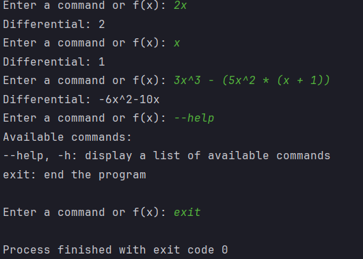

# Учебный проект по Python - Дифференцирование:
### Это консольное приложение, которое позволяет находить дифференциал функции от одной переменной - f(x)
### Программа поддерживает базовый перечень операций: Сложение(+), Вычитание(-), Умножение(*), Деление(/). Также переменная x может возводиться в степень действительного числа, оператором: ^
### Пример работы программы:
